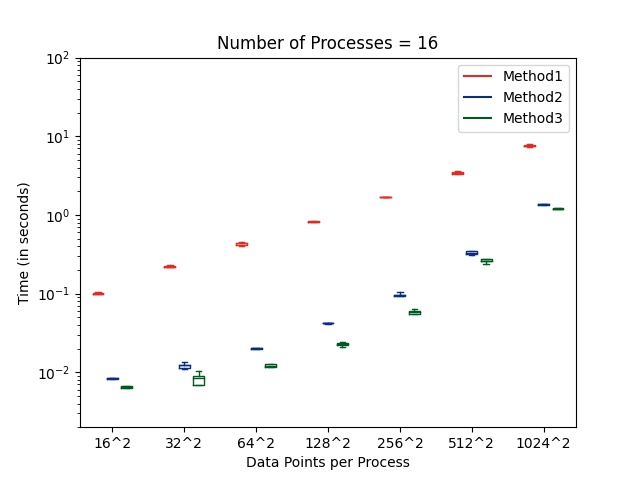
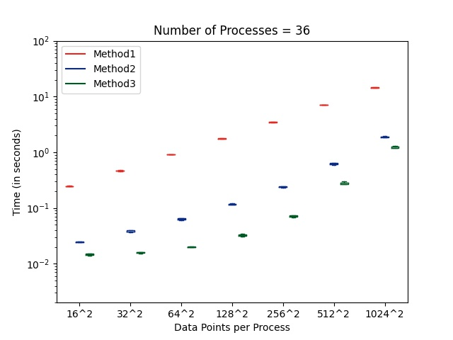
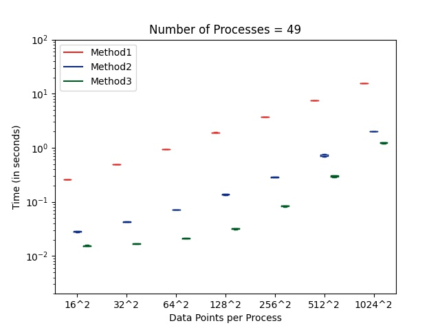
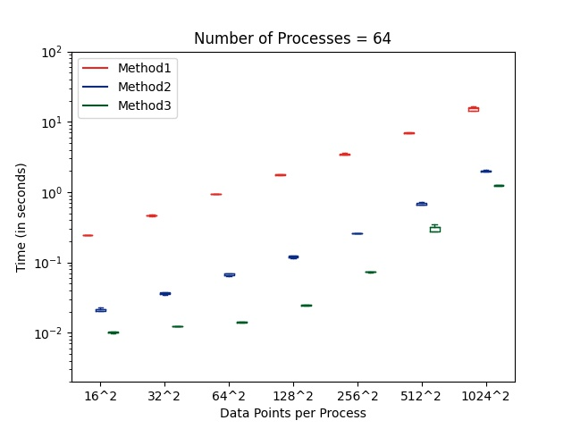

# Assignment 1

## Steps to run the code :
1. Run the job script using `python3 run.py` to generate all the data* files.
2. Run the plot script using `python3 plot.py` to generate all the plot* files (make sure that matplotlib is installed).

## Code Explanation
1. Functions defined in the code and their relevance :
    * These helper functions are to allocate a matrix, randomly intialise it and free a matrix from heap memory respectively.
    ```ruby
    double** init_mat(), void random_init(double** mat), void free_mat(double** mat)
    ```
    * These functions compute the edge points (except the corner points), the non-boundary points and corner points of the matrix of every process at every time step.
    ```ruby
    void compute_edge_points(*args), void compute_inner_points(*args), void compute_corner_points(*args)
    ```
    * These are the function calls corresponding to each of the method which return the time taken to run 50 time steps of computation + communication
    ```ruby
    double method1(double** mat, double** calc_mat), double method2(double** mat, double** calc_mat), double method3(double** mat, double** calc_mat)
    ```
2. The main function initialises the required global vars, calls method* routines and uses MPI_Reduce to get maximum time (computation + communication) for each of the methods among all the processes.
3. The abstraction of process matrix is leveraged to ease out the communication conditions, hence every process has a corresponding `int row` and `int col` in the process matrix and `int up, down, left, right` are used as boolean variables to check if a process is able to communicate values up, down, left or right.
4. The matrix `calc_mat` is used to store the next step evaluation using the current values of `mat`.
5. The code for method1 and method2 is easy to understand, however please refer [Issue(s) faced](#Issue(s)-faced) to get an insight into the method3 code.
6. The job script executes the following functionality in the given order :
    * Invokes `make clean` command to first remove the executable 'halo_exchange', 'hostfile' and the data* files
    * Calls `make` command to build the executable 'halo_exchange' using 'src.c'
    * Runs the bash script 'checkhosts.sh' which generates the hostfile or throws error if minimum number of hosts are not available
    * Executes 'halo_exchange' according the the problem requirement and dumps the output in data* files
7. The plot script assumes data* files to be present in proper format and dumps plot\* images.
8. Format of data in data* files (say data16.txt for example) is as follows
    ```ruby
    for every N in [16^2, 32^2, ..., 1024^2] :
        repeat 5 times :
            <time> for method 1
            <time> for method 2
            <time> for method 3
    ```

## Observations
* For every (P, N) pair, it is observable that method3 is the most efficient, followed by method2 and then method1. This is easy to explain since method1 invokes MPI_Send to send every double (communication overhead) whereas method2 invokes MPI_Send to send the entire buffer at a time (though has MPI_Pack/Unpack overhead) but method3 works like charm since it defies both the overheads by sending data according to a pre-defined protocol (derived datatype).
* For every (P, method) pair, there is an increasing trend of time with N, which is quite intuitive since with increase in N, the amount of computation and data to be communicated increases, thus pushing the overhead.
* For every (N, method) pair, there isn't much change in time with increasing P, which is expected since computation + communication time per process does not depend upon total number of independent processes running, if N and method number are treated constant.

## Box Plots





## Issue(s) faced
The N=1024^2 use case required dynamic allocation of matrices (stack limit exceeded on static allocation). However, this led to unexpected behaviour from MPI_Type_vector call since it assumes contiguous memory buffer to work upon (and dynamically allocated matrices are not contiguous in memory). The workaround for this was to use MPI_Type_indexed call with suitable offsets so that the discontiguous memory could be taken care of.
